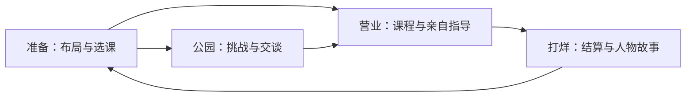

# 撸铁大亨：社区教练冒险版 — 设计包 v1

日期：2026-09-06  
状态：设计基线；用户已委托设计，详细数值为首轮试玩假设；尚未实现。  
工作名：**撸铁大亨：街角健身房**。保留仓库项目名 GymManager。

## 设计决定

玩家扮演重新创业的程教练，在街区结识有各自目标的人，回到老健身房安排课程、亲自指导、改善空间，最终举办一场小小的乐队包场活动。主角的操作、布局的影响和会员的故事共同驱动成长。

参考《潜水员戴夫》的探索与营业交替、富有表现力的像素角色和场景纵深。人物、场所、故事与交互均为本项目原创。第一切片只做一个公园、一间馆、三个营业日。

核心体验：**白天认识一个人，晚上帮他完成一次训练，打烊后期待他明天再来。**

## 阅读顺序

| 文档 | 回答的问题 |
|---|---|
| [玩法 GDD](../../../design/gdd/gym-adventure.md) | 每阶段怎么进行、怎么操作、如何收费、失败后怎么办？ |
| [美术与声音](art-direction.md) | 镜头、人物、器械、动画、光色和声音做到什么标准？ |
| [交互与三天内容](experience-and-content.md) | 玩家看见什么、按什么、每天发生什么？ |
| [实施与验收](implementation.md) | 复用什么、改造什么、先做哪一步、怎么证明做对？ |
| [数值候选](design-tuning.json) | 新模式的参数、角色和课程 ID 如何统一？ |
| [审查记录](review.md) | 哪些矛盾已处理，哪些还需原型验证？ |

`design-tuning.json` 是设计数据样本，**不被当前游戏加载**。GDD 决定规则语义，JSON 是本切片数值与稳定 ID 的登记表；修改任一处须检查另一处。这里没有宣布旧系统已经升级完成，也没有创建或关闭生产 story。

## 为什么选择这条路线

| 方案 | 价值 | 代价 | 决定 |
|---|---|---|---|
| 主角＋街区活动＋营业 | 操作、发现、经营相互反馈 | 增加阶段、课程、关系与动画 | 采用，先切三天 |
| 纯经营强化 | 能快速利用既有模拟代码 | 主角参与和探索变化较少 | 保留为现有沙盒模式 |
| 多城区开放世界 | 长期内容空间大 | 地图、资产、剧情、动作数量膨胀 | 首版范围外 |

## 边界与文档优先级

这是命名为 `gym_adventure_slice_v1` 的新体验配置。旧沙盒继续使用当前实现；新模式不得靠改全局默认值悄悄改变旧测试。

1. 新模式玩法以本包和新 GDD 为准；旧 GDD 的空间占用、有效放置、寻路、单一状态所有者与确定性原则继续适用。
2. 新模式的营业阶段、预约名单和互斥收费，显式覆盖旧模式的全天自由模拟、随机到访和统一访问费路径，具体见 GDD。
3. 美术先使用现有 426×240 / 2D 投影做样板。640×360 只在样板可读性未达标时进行对照实验；未经实验不同时更换镜头、分辨率和人物比例。
4. [V3 视觉规格](../../../design/art/visual-remaster-spec-v3.md)继续约束世界像素密度、场景层次和材质；本包补充新人物、交互与样板验收。旧文档里的各轮相机参数不作为新的制作要求。
5. 新的架构契约在实施前需要形成或修订 ADR。本包中的模块划分是拟议设计，不替代已 Accepted 的 ADR。

## 本切片的固定范围

- 13×10 格健身房；四种现有器械定义；借用跑步机与借用瑜伽垫保证开局。
- 一个主角、三位命名 NPC、一套可换装通用会员身体。
- 公园配速一种主要挑战；一对一指导、课程节奏两种馆内互动。
- 两种课程，每晚最多一班、四席；每晚八位普通预约访客。
- 三天故事、一次乐队包场、一项灯光／招牌／清洁外观改造。
- 手动保存、阶段自动保存、暂停、辅助操作、基础音效。

第一切片不做连锁店、开放世界、多人、复杂战斗、完整招聘市场、饮料制作、消耗品供应链或收费扩建。退休拳手承担固定辅助角色，维修师傅承担外观改造；两者的深入经营系统留到切片验证后。

## 原创人物基线

| ID | 名称 | 可记住的特征 | 在切片中的作用 |
|---|---|---|---|
| `coach_cheng` | 程教练 | 宽肩、灰白发缕、青绿运动外套；鼓励时与会员平视 | 玩家主角 |
| `singer_aluo` | 阿洛 | 瘦高、蓬松束发、砖红上衣；喘气时仍用手打拍子 | 三天主故事与包场 |
| `boxer_qiu` | 老邱 | 低重心、宽背、白平头、酒红运动服 | 自动基础指导与接班演出 |
| `mechanic_lin` | 林师傅 | 窄肩、钴蓝工装、芥末黄帽、工具包 | 改造与幽默短演出 |

人物对自己的生活目标认真，幽默来自性格、反差和关系；训练成功可以是节奏、自信和坚持，不使用单一体型变化来代表成功。

## 第一份可玩的交付物

先交付一个营业日的灰盒：公园正式挑战 → 回店 → 四人课程 → 阿洛来信 → 存档退出并继续。随后用一间美术样板房覆盖这条已能运行的链路，再扩展到三天。

40–60 分钟是三天切片的目标体验时长，不是当前试玩结论。开发排期应在完成首日灰盒、测出单角色和单器械资产制作成本后确定。

## 参考依据

- [《潜水员戴夫》官方介绍](https://store.steampowered.com/app/1868140/DAVE_THE_DIVER/)：昼夜活动、经营、人物叙事及 2D/3D 视觉。
- [导演 Jaeho Hwang 访谈](https://www.gamedeveloper.com/design/dave-the-diver)：分阶段让玩家聚焦活动，支线与主循环相互支持。
- 本仓 2026-09-05 审查：本机 Godot 4.7.1，全量测试 6180/0；这是改造前基线，不代表本设计已通过功能验证。

## 变更记录

- 2026-09-06：用户在确认总体方向后委托详细设计并要求继续；编制 v1。参数、角色名与剧情对白均可随试玩修订，未获得额外的数值或美术成品验收。
